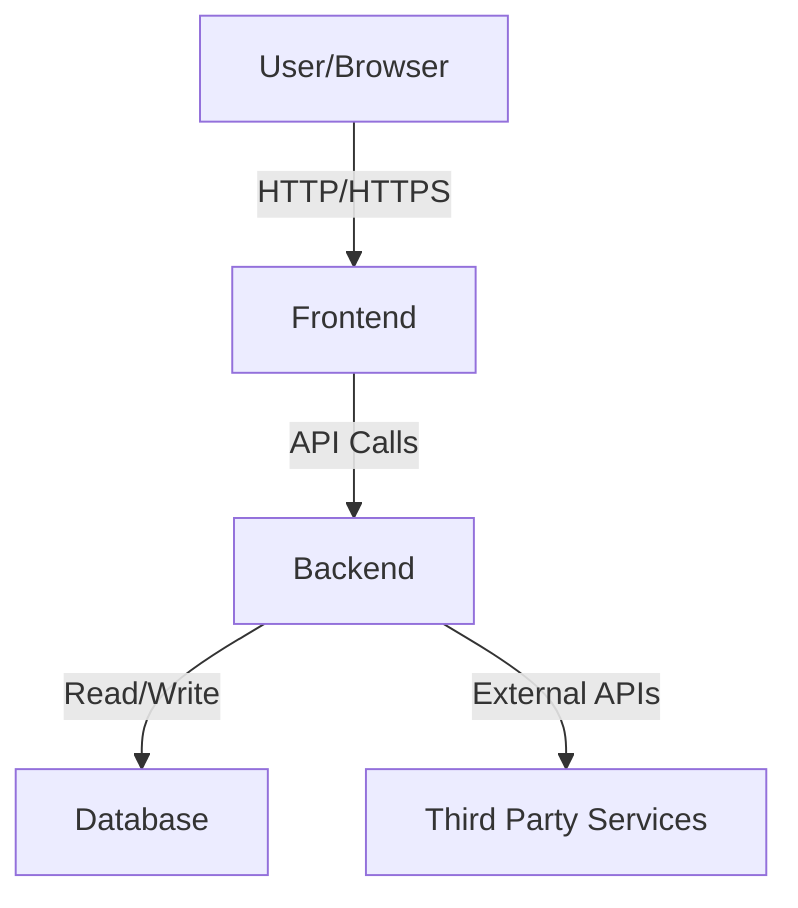

# Architecture Overview - Typing Practice Tool

## System Architecture



## Component Structure

### Frontend Layer
- **UI Components**: Reusable presentational components
- **Container Components**: Business logic and state management
- **Hooks**: Custom React hooks for shared functionality
- **Utils**: Helper functions and utilities

### Backend Layer
- **Routes**: API endpoint definitions
- **Controllers**: Request handling and response formatting
- **Services**: Business logic implementation
- **Models**: Data structure definitions

### Data Layer
- **Database**: Primary data storage
- **Cache**: Performance optimization layer
- **Storage**: File and asset storage

## Design Patterns

### 1. Component Composition
Building complex UIs from simple, reusable components.

### 2. Container/Presentation Pattern
Separating business logic from presentation logic.

### 3. API Layer Abstraction
Centralized API client with error handling and authentication.

### 4. State Management
Centralized state with predictable mutations.

## Data Flow

```
User Action → Dispatch → Reducer → State Update → Re-render → UI Update
```

## Security Considerations

- Input validation on all endpoints
- XSS prevention through output encoding
- CSRF protection for state-changing operations
- Rate limiting to prevent abuse
- Secure authentication with JWT

## Performance Optimizations

- Code splitting and lazy loading
- Image optimization and lazy loading
- Memoization of expensive computations
- Debounced user inputs
- Cached API responses

## Scalability

- Horizontal scaling ready
- Stateless architecture
- CDN integration for static assets
- Database indexing and query optimization

---

Last Updated: 2026-03-06
